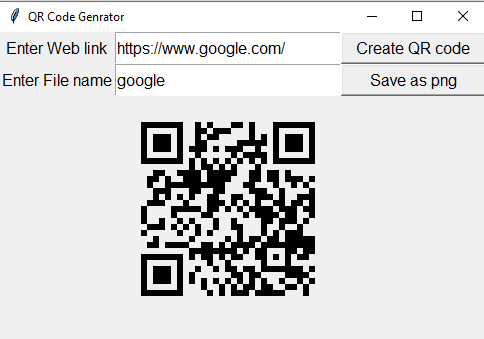

# QR-code

This is the python program for creating your own QR code. Just you need to provide your weblink and your file name. After that, you can scan the code, User will get the information that you had fed in the QR Code.

## How it works?

* You first need to clone this project with this command-` git clone https://github.com/shivkaansh/QR-code-.git` or, you can also download the zip file.

* We need some of the modules for this project, so after cloning please get into the folder with `cd QR-code`. 

* After that, download all the modules with the command `pip install -r requirements.txt`.

* we did'nt added `pip install jupyter` in the requirements file, so if you want you can download it manually!!
---

After running the program, you will getting this page,

- You first need to `enter web link` then generate qr code and then `save as png` file!

- Then you will be left over with the folder `QRCodes` which contains your png images files.

## Contribution

- If you think, more should be added, we are always open to pull requests.

- If you find any difficulty in the process, please post that in the issues and by chance you have solution, we are open!! 

